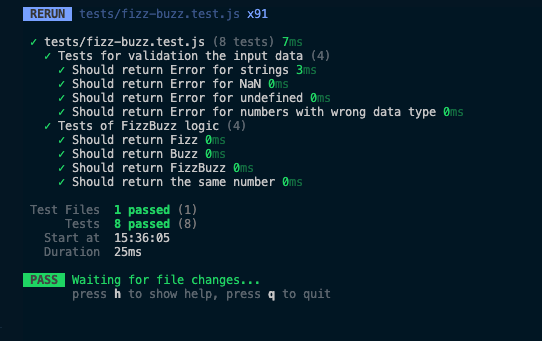

# F5 EJERCICIO - JavaScript, Vitest

**Stack:**:
- JavaScript
- Vitest
- Node.js

**Metodología de los testos:** 
- TDD (Test Driven Development)
- Separar los bloques `describe` entre la validación de datos y la lógica del proyecto.


## Plan de v2.0.0:

- Criteria acceptacion 
- test 
- funcion ( salida -> list[1-100] )

Tengo que hacer:
- funcion para crear una lista de numeros 1 - 100.
- tests de diferentes casos (no para todos los numeros)
- salida debe ser una lista (no imprint)


## Plan de v1.0.0:
0. ✅ Escribir un plan en `README.md`. 
1. ✅ Preparacuib del proyecto.
    - Crear un repositorio locale.
    - Instalar los dependencias. 
2. ✅ Escribir tests para todos los escenarios en `fizz-bazz.test.js`.
3. ✅ Crear funcion `checkNumbers()` con solamente primer escenario en `fizz-bazz.js`, hacer un test.
4. ✅ Anadir una lógica en `fizz-bass.js` pora mas escenarios.
5. ✅ Modificar el test para recibir un Error correctamente.
6. ✅ Hacer todos los testos y hacer el screenshot de la pantalla.
7. ✅ Anadir una programa para encontrar respuestas para cada numero de 0 a 100.
8. ✅ Push a GitHub repositorio.


## Testing Screenshot:


## Salida de consola al ejecutar el programa:

```
EJ-JS1 git:dev ❯ npm start                                                                                   

> ej-js1@1.0.0 start
> node index.js

=== FizzBuzz ===

1 -> 1
2 -> 2
3 -> Fizz
4 -> 4
5 -> Buzz
6 -> Fizz
7 -> 7
8 -> 8
9 -> Fizz
10 -> Buzz
11 -> 11
12 -> Fizz
13 -> 13
14 -> 14
15 -> FizzBuzz
16 -> 16
17 -> 17
18 -> Fizz
19 -> 19
20 -> Buzz
21 -> Fizz
22 -> 22
23 -> 23
24 -> Fizz
25 -> Buzz
26 -> 26
27 -> Fizz
28 -> 28
29 -> 29
30 -> FizzBuzz
31 -> 31
32 -> 32
33 -> Fizz
34 -> 34
35 -> Buzz
36 -> Fizz
37 -> 37
38 -> 38
39 -> Fizz
40 -> Buzz
41 -> 41
42 -> Fizz
43 -> 43
44 -> 44
45 -> FizzBuzz
46 -> 46
47 -> 47
48 -> Fizz
49 -> 49
50 -> Buzz
51 -> Fizz
52 -> 52
53 -> 53
54 -> Fizz
55 -> Buzz
56 -> 56
57 -> Fizz
58 -> 58
59 -> 59
60 -> FizzBuzz
61 -> 61
62 -> 62
63 -> Fizz
64 -> 64
65 -> Buzz
66 -> Fizz
67 -> 67
68 -> 68
69 -> Fizz
70 -> Buzz
71 -> 71
72 -> Fizz
73 -> 73
74 -> 74
75 -> FizzBuzz
76 -> 76
77 -> 77
78 -> Fizz
79 -> 79
80 -> Buzz
81 -> Fizz
82 -> 82
83 -> 83
84 -> Fizz
85 -> Buzz
86 -> 86
87 -> Fizz
88 -> 88
89 -> 89
90 -> FizzBuzz
91 -> 91
92 -> 92
93 -> Fizz
94 -> 94
95 -> Buzz
96 -> Fizz
97 -> 97
98 -> 98
99 -> Fizz
100 -> Buzz

=== Gracias ===
```

## Escenarios:

```
Scenario: Número divisible por 3
    Given que proporciono el número 3
    When ejecuto la función FizzBuzz
    Then el resultado debe ser "Fizz"
```

```
Scenario: Número divisible por 5
    Given que proporciono el número 5
    When ejecuto la función FizzBuzz
    Then el resultado debe ser "Buzz"
```

```
Scenario: Número divisible por 3 y 5
    Given que proporciono el número 15
    When ejecuto la función FizzBuzz
    Then el resultado debe ser "FizzBuzz"
```

```
Scenario: Número no divisible ni por 3 ni por 5
    Given que proporciono el número 7
    When ejecuto la función FizzBuzz
    Then el resultado debe ser "7"
```

```
Scenario: El dato proporcionado no es un número
    Given que proporciono el valor "hola"
    When ejecuto la función FizzBuzz
    Then debe lanzarse un error indicando que el dato no es un número
```


